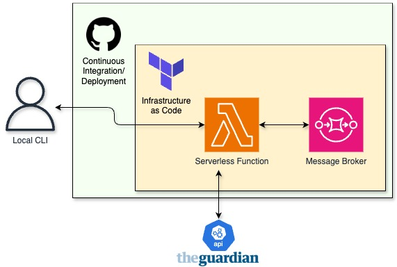
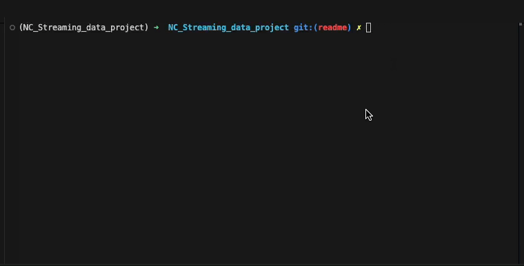
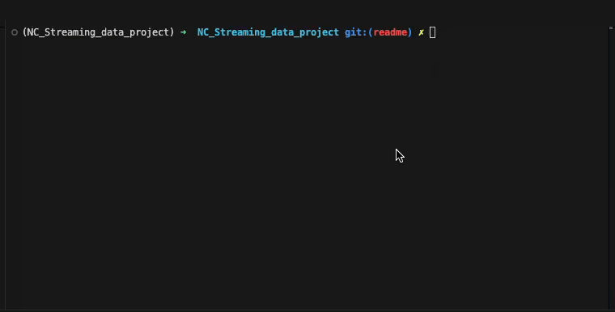

<a id="readme-top"></a>

[![LinkedIn][linkedin-shield]][linkedin-url]
![Python][Python-shield]
![Github-Actions][Github-actions-shield]
![Coverage-Shield][Coverage-shield]

# Guardian API Data Streaming Tool - Data Engineering Project

<!-- TABLE OF CONTENTS -->
<details>
  <summary>Table of Contents</summary>
  <ol>
    <li>
      <a href="#about-the-project">About The Project</a>
    </li>
    <li>
      <a href="#getting-started">Getting Started</a>
      <ul>
        <li><a href="#prerequisites">Prerequisites</a></li>
        <li><a href="#installation">Installation</a></li>
      </ul>
    </li>
    <li><a href="#usage">Usage</a></li>
    <li><a href="#contact">Contact</a></li>
  </ol>
</details>

<!-- ABOUT THE PROJECT -->
## About The Project

With this tool you can retrieve articles from The Guardian API and automatically publish them to AWS SQS message broker.



Key Features:
- User-friendly CLI interface for triggering article ingestion
- Additional invocation option using arguments for programmatic integration 
- Helpful error handling to solve any issues
- Easy tear-down and testing using automated commands
- Serverless cloud infrastructure using AWS Lambda and SQS
- Infrastructure as Code through Terraform
- Constructed using Continuous Integration and Deployment through Github Actions


<!-- GETTING STARTED -->
## Getting Started

### Prerequisites

Make sure the following tools are installed and properly configured before setting up the project:

- Python 3.11+ – Install from [python.org](https://python.org)
- AWS CLI – With credentials configured (via aws configure)
    - Requires an active [AWS account](https://aws.amazon.com/) with sufficient IAM permissions
- [Terraform](https://developer.hashicorp.com/terraform) – Used for infrastructure provisioning
  
- [UV](https://github.com/astral-sh/uv) - Used for managing dependencies and virtual environments
   


### Installation

1. Get a free Guardian API Key at [bonobo.capi.gutools.co.uk/register/developer](https://bonobo.capi.gutools.co.uk/register/developer)

2. Click 'Fork' to fork the Repository & clone it using these commands in your terminal:
    ```
    git clone https://github.com/your-username/your-repo-name.git
    cd your-repo name
    ```

3. Setup Terraform Backend in one of two ways:
- Local backend setup, alter the ```provider.tf``` file so that the backend section looks like this:
  ```
    backend "local" {
      path = "terraform.tfstate"
    }
  ```
- Remote bucket setup - [See Instructions](https://developer.hashicorp.com/terraform/language/backend/s3)
  - This requires creating a bucket with the correct permissions
  - Alter the ```provider.tf``` file so that the backed section contains your own bucket details:
    ```
    backend "s3" {
        bucket = "your-own-tf-state-bucket"       
        key    = "your-project-name/terraform.tfstate"  
        region = "your-region"                      
      }
    ```
4. Create a file called ```terraform.tfvars``` in the ```./terraform/``` folder
  - Write the following (required for Terraform):
    ```
    aws_region       = "your-aws-region-here"
    lambda_name      = "name-your-lambda-here"
    guardian_api_key = "input-Guardian-API-key-here"
    sqs_queue_name   = "name-your-sqs-queue-here"
    ```
5. Create a file called ```.env``` in the ```./src/``` folder
- Write the following (required for invoking from local CLI):
  ```
  LAMBDA_NAME = "input-same-lambda-name-here"
  ```
6. Run this command to install packages and deploy AWS services:
    ```
    make deploy
    ```
    - This command will also check if UV and Terraform are installed correctly
7. Optional: Run this command to deploy project and run all tests:
    ```
    make all
    ```
  - Run this command to run tests
    ```
    make unit-test
    ```
  - Run this command to see all available commands
    ```
    make help
    ```


<p align="right">(<a href="#readme-top">back to top</a>)</p>

<!-- USAGE EXAMPLES -->
## Usage

Once deployed, the tool can be easily invoked in two ways:
- Using Command Line Interface:
  ```
  make invoke
  ```



- Using arguments in the following format:
```
make invoke q=query ref=reference d=2001-01-01
```


Things to note:
- Date parameter (d=) is optional
- If you want to search for multiple words use this command:
```
uv run src/local_invoke.py -q multiple word query -d yyyy-mm-dd -ref reference_here
```
<p align="right">(<a href="#readme-top">back to top</a>)</p>


<!-- CONTACT -->
## Contact

* LinkedIn: [https://www.linkedin.com/in/-andrew-stride-](https://www.linkedin.com/in/-andrew-stride-/)
* Github:
[https://github.com/andrewstride](https://github.com/andrewstride)

<p align="right">(<a href="#readme-top">back to top</a>)</p>

<!-- MARKDOWN LINKS & IMAGES -->

[linkedin-shield]: https://img.shields.io/badge/-LinkedIn-black.svg?style=for-the-badge&logo=linkedin&colorB=555
[linkedin-url]: https://linkedin.com/in/-andrew-stride-
[Python-shield]: https://img.shields.io/badge/Python-FFD43B?style=for-the-badge&logo=python&logoColor=blue
[Github-actions-shield]:https://img.shields.io/badge/Github%20Actions-282a2e?style=for-the-badge&logo=githubactions&logoColor=367cfe
[Coverage-shield]:https://img.shields.io/badge/coverage-100%25-green
